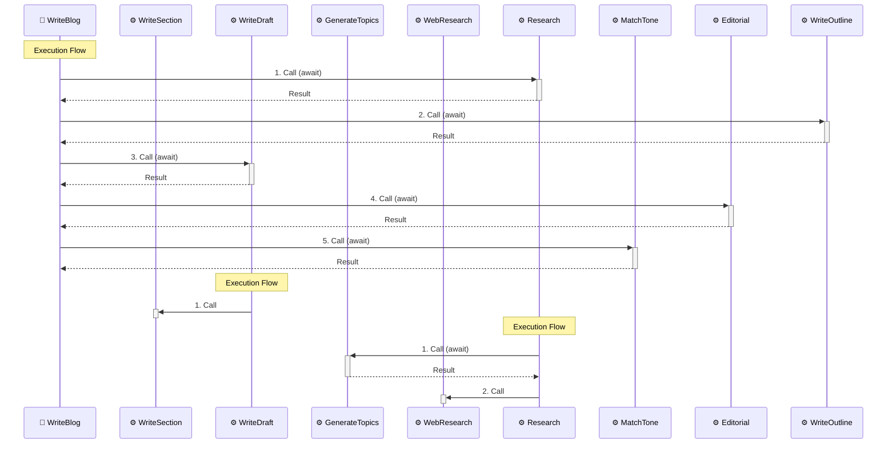

# Workflow Analysis Tool

This directory contains a CLI tool for statically analyzing JavaScript/TypeScript projects that use the gensx-core package to build workflows and components.

## `analyze-workflows.ts`

A comprehensive analyzer that can follow imports and analyze component files across multiple files to build a complete dependency graph of workflows and components.

**Usage:**
```bash
tsx scripts/analyze-workflows.ts <path-to-workflows.ts> [options]
```

**Example:**
```bash
# Basic analysis
tsx scripts/analyze-workflows.ts ./examples/openai-examples/src/workflows.ts

# Analysis with cross-file dependencies
tsx scripts/analyze-workflows.ts ./examples/blog-writer/src/workflows.ts

# With mermaid diagram
npm run analyze:workflows ./examples/openai-examples/src/workflows.ts -- --mermaid

# Detailed analysis with visual diagram
npm run analyze:workflows ./examples/blog-writer/src/workflows.ts -- --verbose --mermaid

# JSON output for programmatic use
tsx scripts/analyze-workflows.ts ./examples/blog-writer/src/workflows.ts --json
```

## Options

- `--json` - Output the analysis results in JSON format for programmatic use
- `--mermaid` - Generate a Mermaid diagram showing the workflow/component relationships
- `--verbose` - Show detailed analysis including file paths and cross-file dependencies

## What It Analyzes

The analyzer detects workflows and components regardless of how the `Workflow` and `Component` functions are imported.

### Supported Import Patterns

**Namespace imports:**
```typescript
import * as gensx from "@gensx/core";
const MyWorkflow = gensx.Workflow("MyWorkflow", async (props) => {
  // workflow logic
});
```

**Named imports:**
```typescript
import { Workflow, Component } from "@gensx/core";
const MyWorkflow = Workflow("MyWorkflow", async (props) => {
  // workflow logic
});
```

**Aliased imports:**
```typescript
import { Workflow as W, Component as C } from "@gensx/core";
const MyWorkflow = W("MyWorkflow", async (props) => {
  // workflow logic
});
```

**Mixed imports:**
```typescript
import gensx, { Workflow, Component as C } from "@gensx/core";
const MyWorkflow = Workflow("MyWorkflow", async (props) => {
  // workflow logic
});
```

### Dependencies & Flow Analysis
The analyzer tracks:
- **Execution Order** - The sequential order in which components are called
- **Async Patterns** - Whether calls are awaited or started in parallel
- **Cross-File Dependencies** - Components imported from other files
- **Line Numbers** - Exact source code locations of each call (with `--verbose`)
- **Call Hierarchy** - The complete dependency tree with flow visualization

#### Flow Indicators
- **`(await)`** - Indicates the call is awaited (blocking)
- **No indicator** - Call is not awaited (parallel/fire-and-forget)
- **Numbers** - Show the order of execution within each function
- **Arrows (→)** - Connect components in execution order

#### Sequence Diagram Benefits
The analyzer uses **Mermaid sequence diagrams** instead of traditional graph diagrams for superior flow visualization:

- **⏱️ Temporal Order** - Shows execution sequence over time, left to right
- **🔄 Activation Boxes** - Visual indication of when components are "active" during execution  
- **↩️ Return Flows** - Clear visualization of awaited vs. fire-and-forget operations
- **📋 Execution Context** - Groups related calls with "Execution Flow" notes
- **🎯 Participant Focus** - Clear distinction between workflows (🔄) and components (⚙️)

## Output

The analysis provides:

1. **Workflows List** - All workflows found with their dependencies
2. **Components List** - All components found with their dependencies  
3. **Dependency Graph** - Relationships between workflows and components
4. **Summary Statistics** - Counts of workflows, components, dependencies, and files
5. **Mermaid Diagram** (with `--mermaid` flag) - Visual representation of the dependency graph

## Example Output

### Blog Writer Analysis
```
🔍 Workflow Analysis Results
==================================================

📁 Analyzed Files: 5

📋 Workflows:
  • WriteBlog (WriteBlog)
    File: examples/blog-writer/src/workflows.ts
    Flow: Research (await) → WriteOutline (await) → WriteDraft (await) → Editorial (await) → MatchTone (await)

🔧 Components:
  • WriteDraft (WriteDraft)
    File: examples/blog-writer/src/components/draft.ts
    Flow: WriteSection
  • Research (Research)
    File: examples/blog-writer/src/components/research.ts
    Flow: GenerateTopics (await) → WebResearch

🔗 Dependency Graph:
  📍 WriteBlog:
    1. → Research (await)
    2. → WriteOutline (await)
    3. → WriteDraft (await)
    4. → Editorial (await)
    5. → MatchTone (await)
  📍 WriteDraft:
    1. → WriteSection
  📍 Research:
    1. → GenerateTopics (await)
    2. → WebResearch

📊 Summary:
  Workflows: 1
  Components: 8
  Dependencies: 8
  Files: 5
```

### Mermaid Sequence Diagram Output


## Features

The analyzer provides comprehensive analysis capabilities:

- **Complete Project Analysis** - Analyzes single files or entire TypeScript projects with cross-file dependencies
- **Universal Import Detection** - Supports all import patterns: namespace, named, aliased, and mixed imports
- **Smart Import Resolution** - Follows relative imports and handles TypeScript `.js` to `.ts` mapping
- **Sequential Flow Analysis** - Tracks the order of component calls within workflows and components
- **Async/Await Detection** - Distinguishes between awaited and non-awaited async operations
- **Dependency Graph Generation** - Maps all relationships between workflows and components with execution order
- **Multiple Output Formats** - Text summary, JSON data, and Mermaid sequence diagrams showing temporal execution flow
- **Intelligent Filtering** - Focuses on gensx patterns while filtering out external API calls

## Use Cases

- **Architecture Analysis** - Understand the structure of complex gensx projects
- **Dependency Tracking** - See which components depend on each other
- **Documentation** - Generate visual diagrams of workflow structures
- **Refactoring** - Identify tightly coupled components before making changes
- **Code Review** - Understand the flow and dependencies in pull requests

## Requirements

- Node.js with TypeScript support
- tsx (for running TypeScript files directly)
- Access to the gensx-core package types

## Limitations

- Currently only analyzes gensx.Workflow and gensx.Component patterns
- Does not track external API calls or wrapped SDK functions
- Requires TypeScript AST parsing, so malformed code may cause issues
- Import resolution is limited to relative paths (doesn't resolve node_modules)