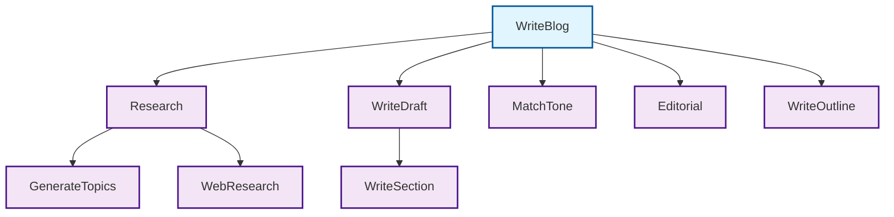

# Workflow Analysis Scripts

This directory contains CLI tools for statically analyzing JavaScript/TypeScript projects that use the gensx-core package to build workflows and components.

## Scripts

### `analyze-workflows.ts`
Basic analyzer that analyzes a single workflows.ts file and extracts workflow and component definitions along with their dependencies.

**Usage:**
```bash
tsx scripts/analyze-workflows.ts <path-to-workflows.ts> [options]
```

**Example:**
```bash
# Basic analysis
tsx scripts/analyze-workflows.ts ./examples/openai-examples/src/workflows.ts

# With mermaid diagram
npm run analyze:workflows ./examples/openai-examples/src/workflows.ts -- --mermaid

# JSON output for programmatic use
tsx scripts/analyze-workflows.ts ./examples/openai-examples/src/workflows.ts --json
```

### `analyze-workflows-enhanced.ts`
Enhanced analyzer that can follow imports and analyze component files across multiple files to build a complete dependency graph.

**Usage:**
```bash
tsx scripts/analyze-workflows-enhanced.ts <path-to-workflows.ts> [options]
```

**Example:**
```bash
# Enhanced analysis with cross-file dependencies
tsx scripts/analyze-workflows-enhanced.ts ./examples/blog-writer/src/workflows.ts

# Detailed analysis with visual diagram
npm run analyze:workflows:enhanced ./examples/blog-writer/src/workflows.ts -- --verbose --mermaid

# Complete analysis of a complex workflow
tsx scripts/analyze-workflows-enhanced.ts ./examples/blog-writer/src/workflows.ts --json
```

## Options

- `--json` - Output the analysis results in JSON format for programmatic use
- `--mermaid` - Generate a Mermaid diagram showing the workflow/component relationships
- `--verbose` - Show detailed analysis including file paths and cross-file dependencies

## What It Analyzes

### Workflows
Functions wrapped with `gensx.Workflow()`:
```typescript
const MyWorkflow = gensx.Workflow("MyWorkflow", async (props) => {
  // workflow logic
});
```

### Components  
Functions wrapped with `gensx.Component()`:
```typescript
const MyComponent = gensx.Component("MyComponent", async (props) => {
  // component logic
});
```

### Dependencies
The analyzer tracks:
- Which components are called by workflows
- Which components call other components
- Cross-file dependencies via imports
- The hierarchy and flow between all workflow elements

## Output

The analysis provides:

1. **Workflows List** - All workflows found with their dependencies
2. **Components List** - All components found with their dependencies  
3. **Dependency Graph** - Relationships between workflows and components
4. **Summary Statistics** - Counts of workflows, components, dependencies, and files
5. **Mermaid Diagram** (with `--mermaid` flag) - Visual representation of the dependency graph

## Example Output

### Blog Writer Analysis
```
🔍 Enhanced Workflow Analysis Results
==================================================

📁 Analyzed Files: 5

📋 Workflows:
  • WriteBlog (WriteBlog)
    File: examples/blog-writer/src/workflows.ts
    Dependencies: Research, WriteOutline, WriteDraft, Editorial, MatchTone

🔧 Components:
  • WriteSection (WriteSection)
    File: examples/blog-writer/src/components/draft.ts
  • WriteDraft (WriteDraft)
    File: examples/blog-writer/src/components/draft.ts
    Dependencies: WriteSection
  • Research (Research)
    File: examples/blog-writer/src/components/research.ts
    Dependencies: GenerateTopics, WebResearch

🔗 Dependency Graph:
  WriteBlog → Research (workflow-to-component)
  WriteBlog → WriteOutline (workflow-to-component)
  WriteBlog → WriteDraft (workflow-to-component)
  WriteBlog → Editorial (workflow-to-component)
  WriteBlog → MatchTone (workflow-to-component)
  WriteDraft → WriteSection (component-to-component)
  Research → GenerateTopics (component-to-component)
  Research → WebResearch (component-to-component)

📊 Summary:
  Workflows: 1
  Components: 8
  Dependencies: 8
  Files: 5
```

### Mermaid Diagram Output


## Use Cases

- **Architecture Analysis** - Understand the structure of complex gensx projects
- **Dependency Tracking** - See which components depend on each other
- **Documentation** - Generate visual diagrams of workflow structures
- **Refactoring** - Identify tightly coupled components before making changes
- **Code Review** - Understand the flow and dependencies in pull requests

## Requirements

- Node.js with TypeScript support
- tsx (for running TypeScript files directly)
- Access to the gensx-core package types

## Limitations

- Currently only analyzes gensx.Workflow and gensx.Component patterns
- Does not track external API calls or wrapped SDK functions
- Requires TypeScript AST parsing, so malformed code may cause issues
- Import resolution is limited to relative paths (doesn't resolve node_modules)